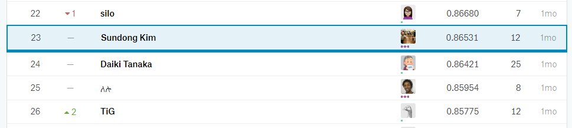

# Fake News Classification (WSDMCup)

This repository is to save the footprint of my solution of fake news classification task, which is one of the three tasks in WSDM Cup 2019.

Link: https://www.kaggle.com/c/fake-news-pair-classification-challenge/leaderboard

I spent one week on this project, and my final submission scores on the 23rd position.

Our solution is a simple blending of diverse pretrained BERT models.

Please follow the notebook files, BTW I deleted a huge portion of intermediary files.

